# Skyline Hospital Time Series Forecasting with XGBoost

**Image Source:** [Facebook Page](https://www.facebook.com/SkylineHospitalAndMedicalCenter)

This is a data analysis project that aimed to forecast future patient arrivals data on the outpatient unit of Skyline Hospital and Medical Center. The repository is for the data analytics feature of the [appointment management system](thesis-manuscript/appointment_management_system_thesis.pdf) of our bachelor's degree thesis.

> [!NOTE]
> Click the [NBViewer URL here](https://nbviewer.org/github/jpsam07/skyline-hospital-time-series-forecasting-with-xgboost/blob/d4274475b42aff2f5ab10a121dc4431fe2e2c84a/Solution_2.ipynb) for a richer view of the analysis done in a Jupyter Notebook. You can also find the URL itself under the About section of this repository.

- [Data Collection](#data-collection)
- [Environment Setup and Data Loading](#environment-setup-and-data-loading)
- [Data Cleaning](#data-cleaning)
- [Feature Engineering](#feature-engineering)
- [Time Lags Creation](#time-lags-creation)
- [Time Series Cross Validation](#time-series-cross-validation)
- [Model Fitting, Forecasting, and Evaluation](#model-fitting-forecasting-and-evaluation)
- [Solution Selection](#solution-selection)

## Data Collection

- Hospital's IT department sent daily time series data of patient arrivals in a csv file via email.
- The time series data time frame was **from May 18, 2020 to December 31, 2022.**

## Environment Setup and Data Loading

The time series data was **loaded into Jupyter Lab using Python**. Relevant libraries for data analysis were also imported:

- `pandas`: for Data Management and Data Manipulation
- `numpy`: for numerical and scientific computing
- `matplotlib`, `seaborn`, `plotly`: for data visualization
- `sklearn.metrics` (scikit-learn): for model evaluation metrics such as RMSE, MAPE, and SMAPE
- `xgboost.XGBRegressor`: a gradient boosting type decision tree machine learning algorithm used for time series forecasting
- `TimeSeriesSplit`: for time series cross-validation

## Data Cleaning

The data cleaning methods used in here include:

- Subsetting columns needed for time series analysis
- Renaming DataFrame columns for better clarity

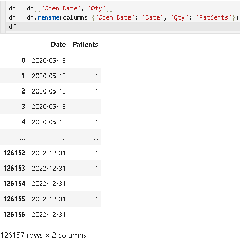

-  Merging duplicate dates with corresponding patient arrival counts

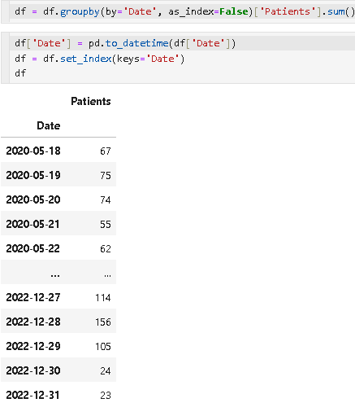

- Missing value imputation

- Outlier analysis

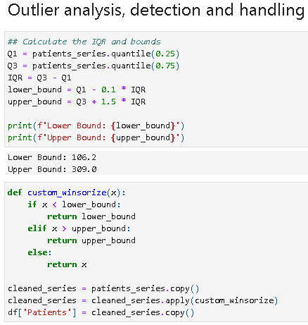

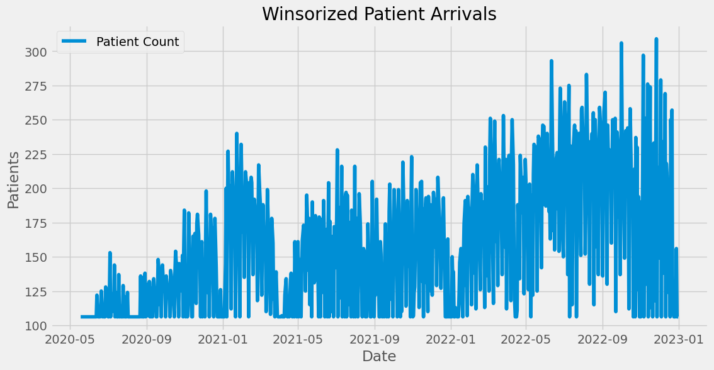

## Feature Engineering

- Added time series features (e.g., day of week, day of year, month, etc.)
- Added rolling statistics and quantiles

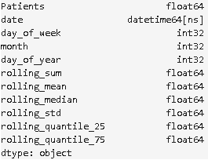

## Time Lags Creation

- Added lags in time to let the XGBoost Regressor model learn historical values and the temporal structure of the data.

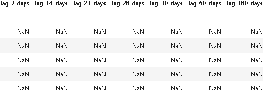

## Time Series Cross-Validation

- Made use of `TimeSeriesSplit` to apply Sliding Window Cross-Validation

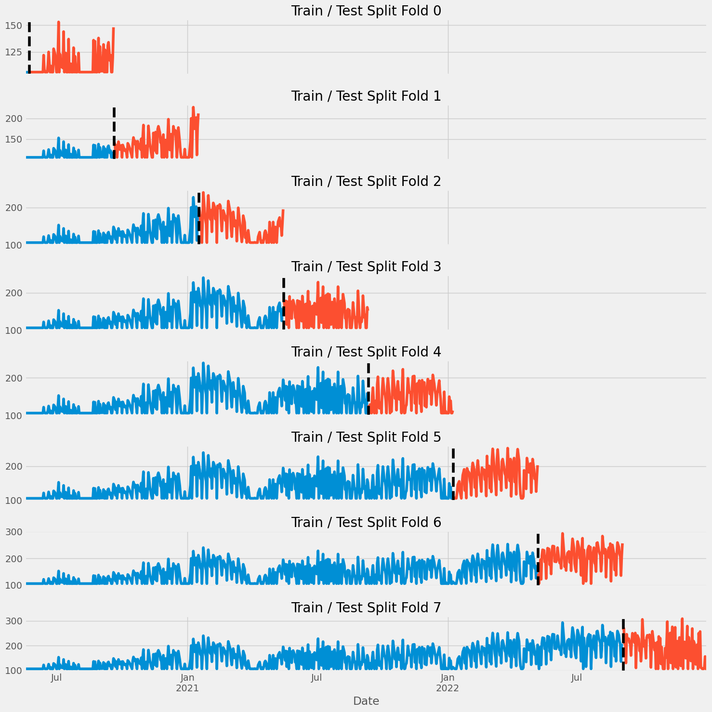

- Extracted the features and the target variable.
- Created training and testing sets

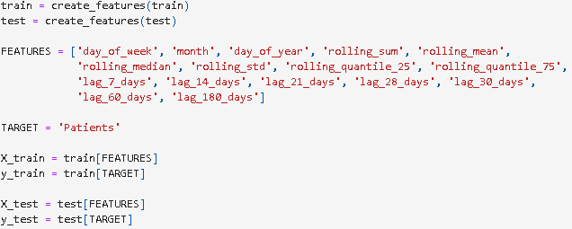

## Model Fitting, Forecasting, and Evaluation

- Fit the XGBoost model on the training set
- Validated on the testing set and plotted the results

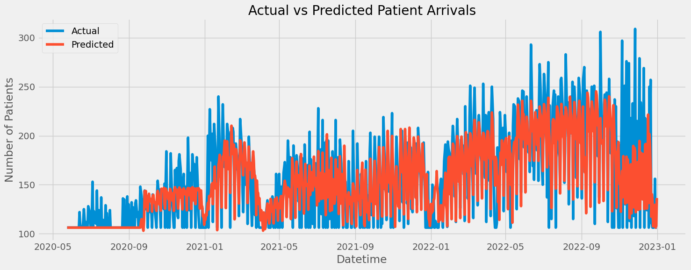

- Evaluated the model with performance metrics across all the folds with root mean squared error (RMSE), mean absolute percentage error (MAPE), and symmetric mean absolute percentage error (sMAPE) with a 11% margin of error.

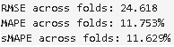

- Plotted feature importance

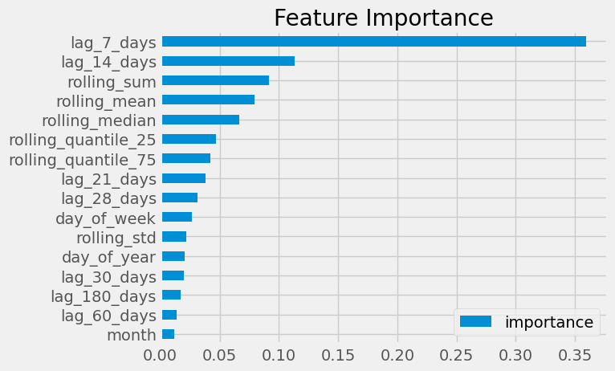

- Generated future patient arrival forecasts

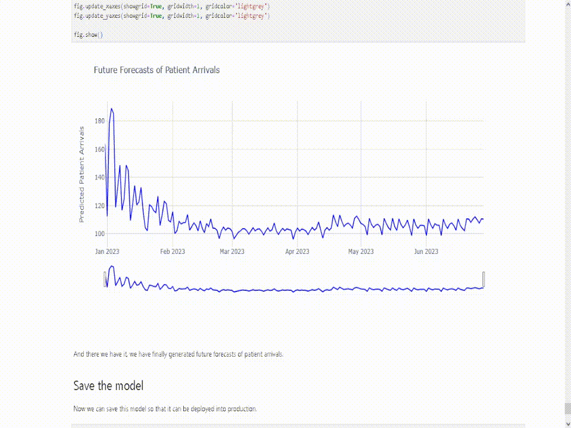

## Conclusion

- Real world time series data can be extremely dirty. I needed to do things like:
	- Dropping of irrelevant columns
	- Renaming of columns
	-  Merging of duplicate dates
	- Missing value imputation
	- Outlier analysis
- The future patient arrival predictions were able to attain an 11% margin of error when tested on the testing set.
- Time lag features are crucial for time series forecasting. For this project, the 7-day time lag was the most effective feature in helping the XGBoost model's forecasting ability.

## Solution Selection

- [Solution 1](https://github.com/jpsam07/skyline-hospital-time-series-forecasting-with-xgboost/blob/d4274475b42aff2f5ab10a121dc4431fe2e2c84a/Solution_1.ipynb) discarded the point in time where the missing values have stopped appearing, and built the XGBoost forecasting model from there.
- [Solution 2](https://nbviewer.org/github/jpsam07/skyline-hospital-time-series-forecasting-with-xgboost/blob/d4274475b42aff2f5ab10a121dc4431fe2e2c84a/Solution_2.ipynb) used missing value imputation with linear interpolation to estimate the missing values, and winsorization to adjust data points that deviate too much from the distribution. Then the XGBoost model was built from there. **This is the favorable solution as the forecast more closely resembles the temporal structure of the time series data** compared to Solution 1.

## References

- Rob Mulla. (2022, August 7). _Time Series Forecasting with XGBoost - Advanced Methods_ [Video]. YouTube. https://www.youtube.com/watch?v=z3ZnOW-S550

- Robikscube. (2022, August 1). _PT2: Time Series Forecasting with XGBoost_. Kaggle. https://www.kaggle.com/code/robikscube/pt2-time-series-forecasting-with-xgboost/notebook